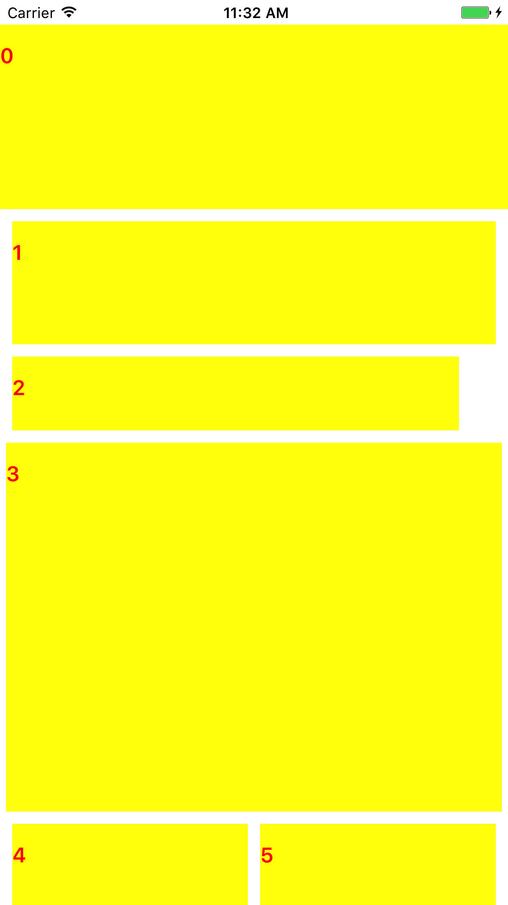
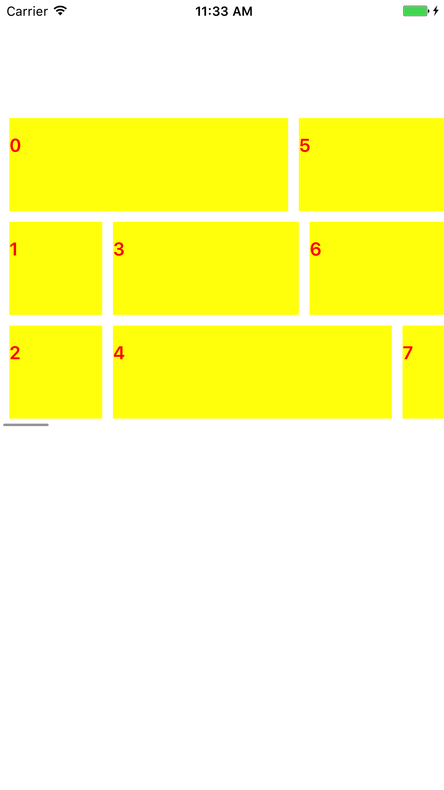
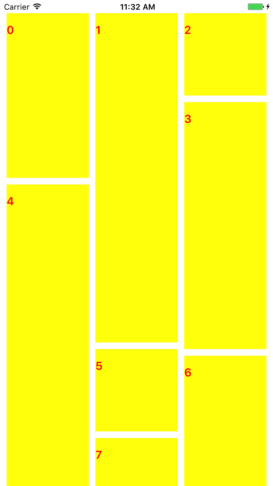
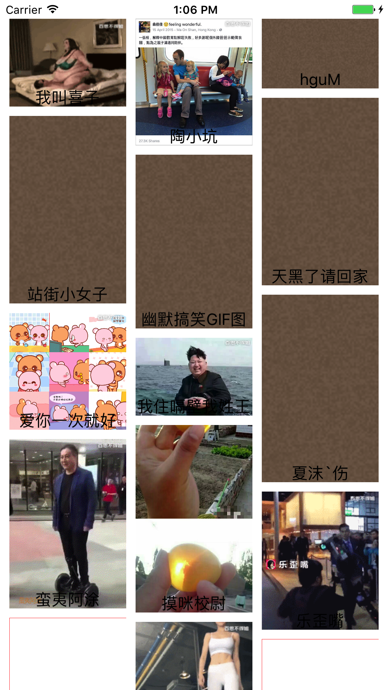
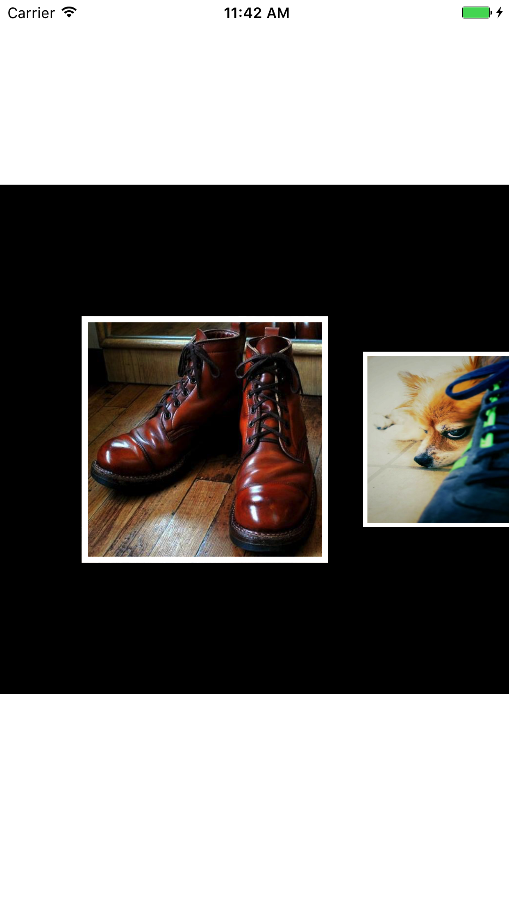
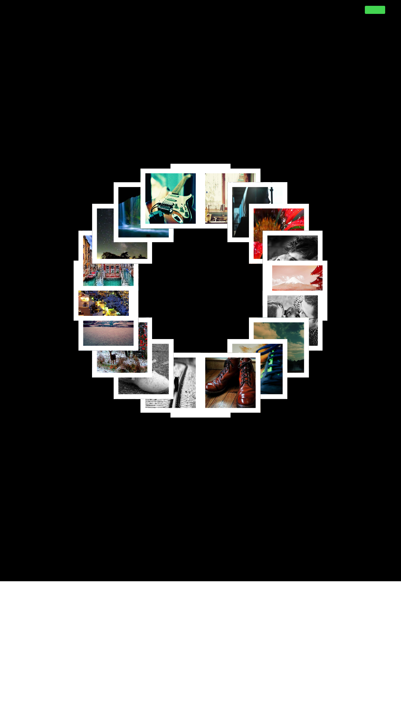
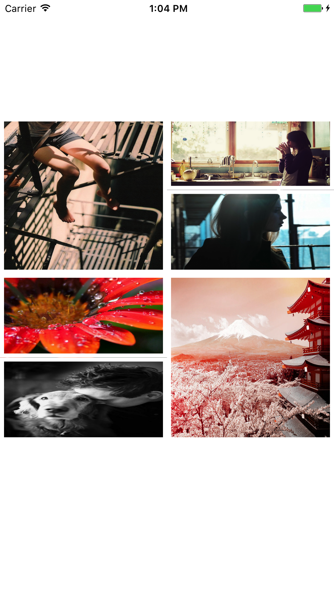

# UICollectionViewLayout各种布局

## 主要是以代理的方式去实现

### JD京东商城首页布局



```objc
@class LMJElementsFlowLayout;


@protocol LMJElementsFlowLayoutDelegate <NSObject>

@required
/**
 *  要求实现
 *
 *  @param waterflowLayout 哪个布局需要代理返回大小
 *  @param  indexPath          对应的cell, 的indexPath, 但是indexPath.section == 0
 *
 *  @return 需要代理高度对应的cell的尺寸
 */
- (CGSize)waterflowLayout:(LMJElementsFlowLayout *)waterflowLayout collectionView:(UICollectionView *)collectionView sizeForItemAtIndexPath:(NSIndexPath *)indexPath;


@optional

/**
 *  列间距, 默认10
 */
- (CGFloat)waterflowLayout:(LMJElementsFlowLayout *)waterflowLayout collectionView:(UICollectionView *)collectionView columnsMarginForItemAtIndexPath:(NSIndexPath *)indexPath;

/**
 *  行间距, 默认10
 */
- (CGFloat)waterflowLayout:(LMJElementsFlowLayout *)waterflowLayout collectionView:(UICollectionView *)collectionView linesMarginForItemAtIndexPath:(NSIndexPath *)indexPath;

/**
 *  距离collectionView四周的间距, 默认{20, 10, 10, 10}
 */
- (UIEdgeInsets)waterflowLayout:(LMJElementsFlowLayout *)waterflowLayout edgeInsetsInCollectionView:(UICollectionView *)collectionView;


@end


@interface LMJElementsFlowLayout : UICollectionViewLayout

/** layout的代理 */
- (instancetype)initWithDelegate:(id<LMJElementsFlowLayoutDelegate>)delegate;

+ (instancetype)flowLayoutWithDelegate:(id<LMJElementsFlowLayoutDelegate>)delegate;


@end

```

###  水平流水布局



```objc
@class LMJHorizontalFlowLayout;


@protocol LMJHorizontalFlowLayoutDelegate <NSObject>

@required
/**
 *  要求实现
 *
 *  @param waterflowLayout 哪个布局需要代理返回高度
 *  @param  indexPath          对应的cell, 的indexPath, 但是indexPath.section == 0
 *  @param itemHeight           layout内部计算的高度
 *
 *  @return 需要代理高度对应的cell的宽度
 */
- (CGFloat)waterflowLayout:(LMJHorizontalFlowLayout *)waterflowLayout collectionView:(UICollectionView *)collectionView widthForItemAtIndexPath:(NSIndexPath *)indexPath itemHeight:(CGFloat)itemHeight;
@optional

/**
 *  需要显示的行数, 默认3
 */
- (NSInteger)waterflowLayout:(LMJHorizontalFlowLayout *)waterflowLayout linesInCollectionView:(UICollectionView *)collectionView;
/**
 *  列间距, 默认10
 */
- (CGFloat)waterflowLayout:(LMJHorizontalFlowLayout *)waterflowLayout collectionView:(UICollectionView *)collectionView columnsMarginForItemAtIndexPath:(NSIndexPath *)indexPath;
/**
 *  行间距, 默认10
 */
- (CGFloat)waterflowLayout:(LMJHorizontalFlowLayout *)waterflowLayout linesMarginInCollectionView:(UICollectionView *)collectionView;

/**
 *  距离collectionView四周的间距, 默认{10, 10, 10, 10}
 */
- (UIEdgeInsets)waterflowLayout:(LMJHorizontalFlowLayout *)waterflowLayout edgeInsetsInCollectionView:(UICollectionView *)collectionView;


@end


@interface LMJHorizontalFlowLayout : UICollectionViewLayout

/** layout的代理 */
- (instancetype)initWithDelegate:(id<LMJHorizontalFlowLayoutDelegate>)delegate;

+ (instancetype)flowLayoutWithDelegate:(id<LMJHorizontalFlowLayoutDelegate>)delegate;
@end


```

### 垂直流水布局



```
@class LMJVerticalFlowLayout;


@protocol LMJVerticalFlowLayoutDelegate <NSObject>

@required
/**
 *  要求实现
 *
 *  @param waterflowLayout 哪个布局需要代理返回高度
 *  @param  indexPath          对应的cell, 的indexPath, 但是indexPath.section == 0
 *  @param width           layout内部计算的宽度
 *
 *  @return 需要代理高度对应的cell的高度
 */
- (CGFloat)waterflowLayout:(LMJVerticalFlowLayout *)waterflowLayout collectionView:(UICollectionView *)collectionView heightForItemAtIndexPath:(NSIndexPath *)indexPath itemWidth:(CGFloat)itemWidth;
@optional

/**
 *  需要显示的列数, 默认3
 */
- (NSInteger)waterflowLayout:(LMJVerticalFlowLayout *)waterflowLayout columnsInCollectionView:(UICollectionView *)collectionView;
/**
 *  列间距, 默认10
 */
- (CGFloat)waterflowLayout:(LMJVerticalFlowLayout *)waterflowLayout columnsMarginInCollectionView:(UICollectionView *)collectionView;
/**
 *  行间距, 默认10
 */
- (CGFloat)waterflowLayout:(LMJVerticalFlowLayout *)waterflowLayout collectionView:(UICollectionView *)collectionView linesMarginForItemAtIndexPath:(NSIndexPath *)indexPath;

/**
 *  距离collectionView四周的间距, 默认{20, 10, 10, 10}
 */
- (UIEdgeInsets)waterflowLayout:(LMJVerticalFlowLayout *)waterflowLayout edgeInsetsInCollectionView:(UICollectionView *)collectionView;


@end


@interface LMJVerticalFlowLayout : UICollectionViewLayout

/** layout的代理 */
- (instancetype)initWithDelegate:(id<LMJVerticalFlowLayoutDelegate>)delegate;

+ (instancetype)flowLayoutWithDelegate:(id<LMJVerticalFlowLayoutDelegate>)delegate;

@end

```

### 百思不得姐图片流水布局和网络加载




### 其他布局Demos



